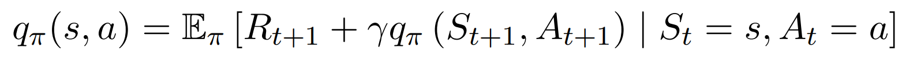
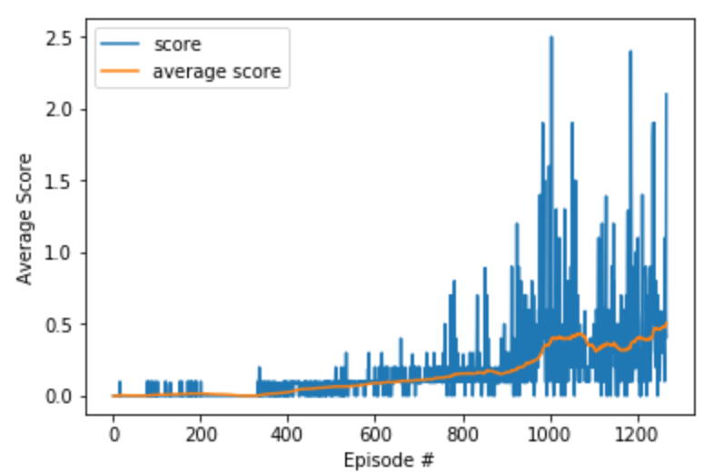

# Deep reinforcement learning Nanodegree(Udacity)
## Competion and collaboration Project
Fabrice Simo Defo  
October 3th, 2020

### Project Overview and benchmarking

In this environment, two agents control rackets to bounce a ball over a net. If an agent hits the ball over the net, it receives a reward of +0.1. If an agent lets a ball hit the ground or hits the ball out of bounds, it receives a reward of -0.01. Thus, the goal of each agent is to keep the ball in play.

The observation space consists of 8 variables corresponding to the position and velocity of the ball and racket. Each agent receives its own, local observation. Two continuous actions are available, corresponding to movement toward (or away from) the net, and jumping.

The task is episodic, means that the environment terminate after 1500 steps maximum, each steps is a succession of state,action,reward,next state. And in order to solve the environment, your agents must get an average score of +0.5 (over 100 consecutive episodes, after taking the maximum over both agents). Specifically,

After each episode, we add up the rewards that each agent received (without discounting), to get a score for each agent. This yields 2 (potentially different) scores. We then take the maximum of these 2 scores.
This yields a single score for each episode.
The environment is considered solved, when the average (over 100 episodes) of those scores is at least +0.5.

### Problem Statement

To make the agent learn, I will use a technique in Deep Reinceforcement Learning called Deep Deterministic Policy Gradient algorithm as proposed by Lillicrap, Timothy P., et al. "Continuous control with deep reinforcement learning.". 

First of all, deep reinforcement is a field of AI in which we use the environement and is feedback to the agent to guide the agent how to learn form it.  [image source](https://missinglink.ai/guides/neural-network-concepts/complete-guide-deep-reinforcement-learning-concepts-process-real-world-applications/)
The procedure is simple. In our case, the agent move in the squareWorld and is in some state H (example: State H velocity 3 mph , ray vision at angle 30 degres from the west wall,...) and if he collects a yellow banana, he receives a reward of +1. When that happens, we will change the way the agent will act in the future to emphasize more the action the agent took when he was in state H.  

In fact, when we are talking about action of an agent, the way we design it is by doing a mapping between a state 'A' the agent might be in (Example State A velocity 2 mph , ray vision at angle 30 degres from the east wall,... ) and the action the agent *SHOULD* take to maximize the total reward (to collect many yellow bananas avoiding blue ones). This mappig here is called the policy π (with π(state = s) = action a) . Now to approach the best policy, we use an intermediary fucntion , Q function or action state value function. And it is given by the 2nd Bellman Equation: 

 [Richard S. Sutton and Andrew G. Barto (p.64)](http://incompleteideas.net/book/RLbook2020.pdf) 

This equation calculates the *EXPECTED* (we are in a stochastic environment) reward we will have when we are in state S and have taken action a, all of that following the policy π (rules for action given the state of the agent when he is moving in the world). So if we can maximize this function , we will just have to take at each state s , the action a that maximizes the q-function. And this processus will be our way to approach the optimal policy π*.

Now with all that in mind, we have to consider a serious fact. Our state are constituted of 37 dimensions and some of them contains real numbers. Means that we have a continuum of state. So our Q function is not like a simple table with discrete state each with 4 actions. What can be a way to transform a real input of 37 real numbers (state s) into 4 real numbers representing (Q(s,left),Q(s,right),...) ? A neural network can be our solution. So we use neural networks to approximate the Q-function. And we maximized it through refreshing the initial Q-function with new values coming from the navigation of the agent. We optimize the neural network by using Adam optimization on this error:  

 
 As you can see, there are 2 Neural networks one local and one target (different parameters θ_local and θ_target ). We use a way to optimize them while stabilizing the learning with some techniques. And one more important problem is that we update the policy parameter through Monte Carlo updates (i.e. taking random samples). This introduces in inherent high variability in log probabilities (log of the policy distribution) and cumulative reward values, because each trajectories during training can deviate from each other at great degrees. Consequently, the high variability in log probabilities and cumulative reward values will make noisy gradients, and cause unstable learning and/or the policy distribution skewing to a non-optimal direction. Besides high variance of gradients, another problem with policy gradients occurs trajectories have a cumulative reward of 0. The essence of policy gradient is increasing the probabilities for “good” actions and decreasing those of “bad” actions in the policy distribution; both “goods” and “bad” actions with will not be learned if the cumulative reward is 0. One way to reduce variance and increase stability is subtracting the cumulative reward by a baseline

**But MORE IMPORTANTLY THERE** is that the environement is not stationary. Meaning that the action of the other agent change the observation of another agents. So by using conventionnal [DDPG](https://arxiv.org/abs/1509.02971), the learning won't be stable. The solution is by making the observations stationary. And a way of doing this is by doing the learning with observation taking into variables the actions of the other agents. This is more explained in the Learning algorithm part.   

## Implementation
The environment was solved using a deep reinforcement learning agent. The implementation can be found in the [Tennis.ipynb](Tennis.ipynb) which contains
contains the rl-agents (2 in total) in the MADDPG part, and also the neural networks to implement the actor critic method. I advise you to read the report on my last projects [Navigation](Deep-Reinforcement-learning-/Navigation) and [Continuous control](Deep-Reinforcement-learning-/Continuous_control)

### Learning algorithm
[MADDPG](https://arxiv.org/abs/1706.02275) which is an actor-critic approach was used as the learning algorithm for the agent.
This algorithm is derived from [DDPG](https://arxiv.org/abs/1509.02971), but manages to solve tasks with multiple agents. You can look at the next image and pseudo-code for better understanding:

MADDPG is an off-policy algorithm and utilizes four neural networks: a local actor, a target actor, a local critic and a target critic
Each training step the experience (state, action, action_other_agent, reward, next state, next_state_other_agent) the two agents gained was stored.
Then every training step the agent learned from a random sample from the stored experience. The actor tries to estimate the
optimal policy by using the estimated state-action values from the critic while critic tries to estimate the optimal q-value function
and learns by using a normal q-learning approach. Using this approach one gains the benefits of value based and policy based
methods at the same time. **By giving the critic access to the action of the other player the learning process gets stabilized
without requiring to give the additional information** to the actor which is the only network required for acting after the
agent was trained successfully.

### Hyperparameters
The following hyperparameters were used:
* replay buffer size: 1e5
* batch size: 250
* discount factor: 0.99
* tau (soft update for target networks factor): 1e-3
* learning rate: 1e-4 (actor) 
* learning rate: 1e-3 (critic)
** OUNoise factors:  mu=0., theta=0.15, sigma=0.2

### Neural networks
The actor model is a simple feedforward network:
* Batch normalization
* Input layer: 24 (input) neurons (the state size)
* 1st hidden layer: 200 neurons (Relu)
* 2nd hidden layer: 250 neurons (Relu)
* output layer: 2 neurons (1 for each action)  (activtation: tanh)

The critic model:
* Batch normalization
* Input layer: 24 (input) neurons (the state size)
* 1st hidden layer: 200 neurons (action with 2 * action_size 2 added) (Relu)
* 2nd hidden layer: 150 neurons (Relu)
* output layer: 1 neuron

## Results
The agent was able to solve the environment **after 1267 episodes achieving an average maximum score of 0.51 over the last 100 episodes**
of the training process.

The average scores and the scores of the 2 agents during the training process:

## Possible future improvements
The algorithm could be improved in many ways such as *Prioritized Experience Replays* and by using RAINBOW on each agent 
which would improve the learning effect gained from the saved experience. 
Also from the last project, adding a layer of BatchNorm1d on the neural networks may help increase drastically the rate of learning 
