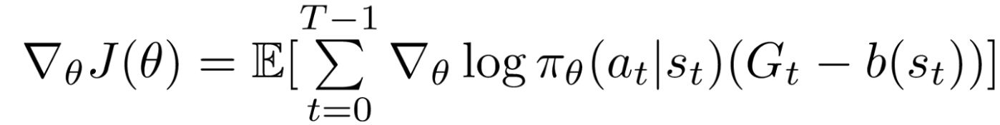
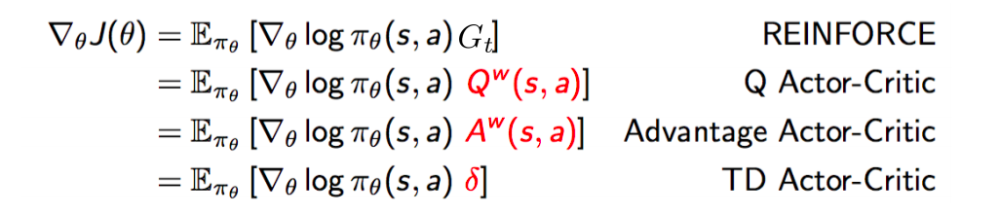
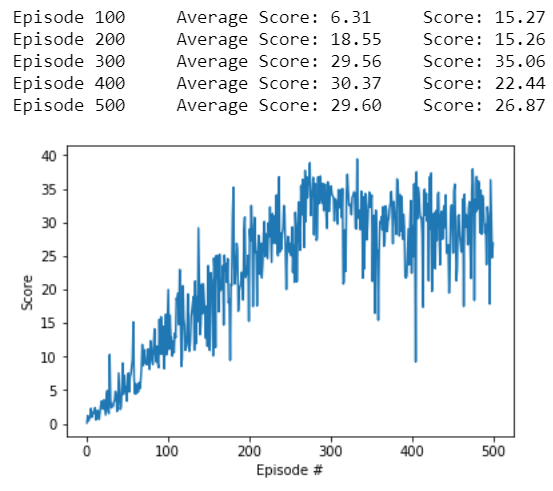

# Deep reinforcement learning Nanodegree(Udacity)
## Continuous Control Project
Fabrice Simo Defo  
Septempber 26th, 2020

## I. Definition

### Project Overview

This project is to train an agnent in the Reacher environment. It is a double joint arm  which have to follow a moving target continuously. So this is a way to train a double-jointed virtual robotic arm to go to Reach (Reacher) a specific given target. A reward of +0.1 is provided for each step that the agent's hand is in the goal location.

The observation space consists of 33 variables corresponding to position, rotation, velocity, and angular velocities of the arm. Each action is a vector with four numbers, corresponding to torque applicable to two joints. Every entry in the action vector should be a number between -1 and 1.
The task is episodic, means that the environment terminate after 1500 steps maximum, each steps is a succession of state,action,reward,next state.

### Problem Statement

To make the agent learn, I will use a technique in Deep Reinceforcement Learning called Deep Deterministic Policy Gradient algorithm as proposed by Lillicrap, Timothy P., et al. "Continuous control with deep reinforcement learning.". 

First of all, deep reinforcement is a field of AI in which we use the environement and is feedback to the agent to guide the agent how to learn form it.  [image source](https://missinglink.ai/guides/neural-network-concepts/complete-guide-deep-reinforcement-learning-concepts-process-real-world-applications/)
The procedure is simple. In our case, the agent move in the squareWorld and is in some state H (example: State H velocity 3 mph , ray vision at angle 30 degres from the west wall,...) and if he collects a yellow banana, he receives a reward of +1. When that happens, we will change the way the agent will act in the future to emphasize more the action the agent took when he was in state H.  

In fact, when we are talking about action of an agent, the way we design it is by doing a mapping between a state 'A' the agent might be in (Example State A velocity 2 mph , ray vision at angle 30 degres from the east wall,... ) and the action the agent *SHOULD* take to maximize the total reward (to collect many yellow bananas avoiding blue ones). This mappig here is called the policy π (with π(state = s) = action a) . Now to approach the best policy, we use an intermediary fucntion , Q function or action state value function. And it is given by the 2nd Bellman Equation: 

 [Richard S. Sutton and Andrew G. Barto (p.64)](http://incompleteideas.net/book/RLbook2020.pdf) 

This equation calculates the *EXPECTED* (we are in a stochastic environment) reward we will have when we are in state S and have taken action a, all of that following the policy π (rules for action given the state of the agent when he is moving in the world). So if we can maximize this function , we will just have to take at each state s , the action a that maximizes the q-function. And this processus will be our way to approach the optimal policy π*.

Now with all that in mind, we have to consider a serious fact. Our state are constituted of 37 dimensions and some of them contains real numbers. Means that we have a continuum of state. So our Q function is not like a simple table with discrete state each with 4 actions. What can be a way to transform a real input of 37 real numbers (state s) into 4 real numbers representing (Q(s,left),Q(s,right),...) ? A neural network can be our solution. So we use neural networks to approximate the Q-function. And we maximized it through refreshing the initial Q-function with new values coming from the navigation of the agent. We optimize the neural network by using Adam optimization on this error:  

 
 As you can see, there are 2 Neural networks one local and one target (different parameters θ_local and θ_target ). We use a way to optimize them while stabilizing the learning with some techniques. And one more important problem is that we update the policy parameter through Monte Carlo updates (i.e. taking random samples). This introduces in inherent high variability in log probabilities (log of the policy distribution) and cumulative reward values, because each trajectories during training can deviate from each other at great degrees. Consequently, the high variability in log probabilities and cumulative reward values will make noisy gradients, and cause unstable learning and/or the policy distribution skewing to a non-optimal direction. Besides high variance of gradients, another problem with policy gradients occurs trajectories have a cumulative reward of 0. The essence of policy gradient is increasing the probabilities for “good” actions and decreasing those of “bad” actions in the policy distribution; both “goods” and “bad” actions with will not be learned if the cumulative reward is 0. One way to reduce variance and increase stability is subtracting the cumulative reward by a baseline
 
The details will be explained in the 'Analysis' part

### Metrics and benchmark

To measure how the agent performs, we will calculate the mean score in the last 100 episodes. A score in an episode is the sum of the rewards in that episode. And if the mean score of the last 100 episodes attains 30, we will considered that the agent is trained enough and that the task is solved. The benchmark is to attain this average score in 1800 episodes maximum. 

## II. Analysis

### Data Exploration

We directly and only use the states given by the environment to make the agent learn. 

### Algorithms and Techniques

One way to reduce variance and increase stability is subtracting the cumulative reward by a baseline:

First you should know that the baseline b(s) has the proprietary of being a constant by doing the gradient by the paramters theta. Meaning that in the gradient formula, we can add or substract a term aslong as it is not dependent on the parameters theta. Intuitively, making the cumulative reward smaller by subtracting it with a baseline will make smaller gradients, and thus smaller and more stable updates.
The baseline can take various values. The set of equations below illustrates the classic variants of actor critic methods (with respect to REINFORCE)

To make the agent learn I used DDPG technique using Q Actor Critic baseline. The process in the in the [DDPG_Project.py](DDPG_Project.py) code is the following:
Learning of continuous actions requires an actor (`Actor` class) and a critic (`Critic` class) model.
The actor model learns to predict an action vector while the critic model learns Q values for state-action pairs.
DDPG uses experience replay (`Replay` class) to sample batches of uncorrelated experiences to train on. 
It also distinguishes between online and target models for both actor and critic, similar to fixed Q-targets and double DQN technique.
Online models are updated by minimizing loses while target models are updated through soft update, 
i.e. online model parameters values are partially transferred to target models. 
This helps to avoid overestimation of Q-values and makes the training more stable.

The core of DDPG algorithm is implemented in the `Agent` class. 
The `act` method generates an action for the given state with the online actor model.
An important aspect is the noise added to the actions to allow exploration of the the action space.
The noise is generated through the Ornstein–Uhlenbeck process, 
which is a stochastic process that is both Gaussian and Markov, drifting towards the mean in long-term.
The `learn` method implements updates to the models and has the following flow:

1. A batch of experiences is sampled from the replay buffer.
2. Update online critic model
    1. Predict actions for the next states with the target actor model
    2. Compute Q-values for the next states and actions with the target critic model
    3. Compute target Q-values for the current states and actions using the Bellman equation
    4. Compute Q values for the current states and actions with the online critic model
    5. Use the target and online Q-values to compute the loss
    6. Minimize the loss for the online critic model
3. Update online actor model
    1. Predict actions for current states from the online actor model
    2. Compute Q-values with the online critic model
    3. Use the Q-values to compute the loss
    4. Minimize the loss for the online actor model
4. Soft update of the target critic and actor models

Training of the agent is implemented in the `run` function, which has the following flow:

1. Every timestep a state of the environment is observed
2. The agent selects an action
3. The environment provides the next state, the reward received and the information whether the episode is completed.
4. State, action, next state and the reward constitute the experience that the agent adds to its replay buffer.
5. When enough experiences are collected the agent learns as described above.

## Network architecture

DDPG uses two network architectures, one for actor and one for critic.
The actor network maps state to action and has the following structure:
 
1. State input (33 units)
2. Hidden layer (256 units) with ReLU activation and batch normalization
3. Hidden layer (256 units) with ReLU activation and batch normalization
4. Action output (4 units) with tanh activation

The critic network maps state and action to Q value and has the following structure:
1. State input (33 units)
2. Hidden layer (256 nodes) with ReLU activation and batch normalization
3. Action input (4 units) + last output from the last hidden layer
4. Hidden layer with inputs from layers 2 and 3 (256 nodes) with ReLU activation and batch normalization
5. Q-value output (1 node)

## Hyperparameters

Values for the hyperparameters were obtained from the original paper and reference implementations 
and then tweaked based on the results of multiple runs.
One of the most important parameters to get right was the standard deviation of the Ornstein–Uhlenbeck process (sigma). 
It controls the exploration-exploitation trade-off.

Another important parameter for boosting the training is the learning rate for actor and critic models.
Values that are too high prevented the agent from achieving high scores while low values slowed down the training process.
Here is the complete list of hyperparamters with their values after turning.

| Hyperparameter | Value | Description |
|---|---:|---|
| Replay buffer size | 1e5 | Maximum size of experience replay buffer |
| Replay batch size | 128 | Number of experiences sampled in one batch |
| Actor hidden units | 256, 256 | Number of units in hidden layers of the actor model |
| Actor critic units | 256, 256, 256, 128| Number of units in hidden layers of the critic model |
| Actor learning rate | 1e-4 | Controls parameters update of the online actor model |
| Critic learning rate | 3e-4 | Controls parameters update of the online critic model |
| Target update mix | 5e-3 | Controls parameters update of the target actor and critic models |
| Discount factor | 0.99 | Discount rate for future rewards |
| Ornstein-Uhlenbeck, mu | 0 | Mean of the stochastic  process|
| Ornstein-Uhlenbeck, theta | 0.17 | Parameter of the stochastic process |
| Ornstein-Uhlenbeck, sigma | 0.24 | Standard deviation of the stochastic process |
| Max episodes | 500 | Maximum number of episodes to train |
| Max steps | 1500 | Maximum number of timesteps per episode |

## Results and Validation

The agent was able to solve the environment by achieving score above 30 over 100 consecutive episodes after 300 episodes.
Plot of the score:

## V. Conclusion

### Reflection and imrpovements

This project was really intersting in terms of applying recent techniques in reinforcement techniques, and in terms of reading papers to understand the justification of these techniques. I am always interested in the mathematical aspect to understand better. Of course when my agent was able to perform such a good score I was really happy ! Just look at this smart arm reaching the target !

This is just the beginning of many experiences and my adventure in the reinforcement Learning field. 
Possible improvements can be: 

-[Prioritized experience replay](https://arxiv.org/abs/1511.05952) or [Double Prioritized State Recycled Experience Replay (DPSR) (July 2020)](https://arxiv.org/abs/2007.03961): These permit to select experriences from which the agent will learn the most by attributing a bigger sample probability of experiences who have big errors (big error will cause big gradient, so big steps in learning). And the recent paper, shows us it is possible to constitute the memory of experience more precisely. Normally, we replace the experiences from new ones in the memory when the agent is acting in the environement. Now the replacement can be smarter, we can discard the experiences with the lowest potential of learning , and not just the earliest because this one can have great potential of lerning (high delta error). This is called prioritized replacing. Now, doing only this can incur bias, because we will only learn from the same experiences of great delta. So to remove this bias, we do state recycling to diversify the experiences (s,a,r,s') , not by experience replacing but by state recycling with the intuition that the same state will have a good delta even with another action. This also helps to explore more different next states from the original replay buffer (memory of experiences). 

-[RAINBOW](https://arxiv.org/abs/1710.02298) Which apply all these techniques in one except the DPSR

- A more systematic way of searching of optimal values for hyperparameters, e.g. grid search, random search, bayesian optimization or genetic algorithm
- Perhaps use Parallel training of other agents to gather multiple experiences while learning. (Possible in version 2 of the reacher environment). This is called [A3C](https://arxiv.org/pdf/1602.01783.pdf)
- Use [PPO](https://spinningup.openai.com/en/latest/algorithms/ppo.html) or even better [D4PG](https://arxiv.org/pdf/1804.08617.pdf) 

